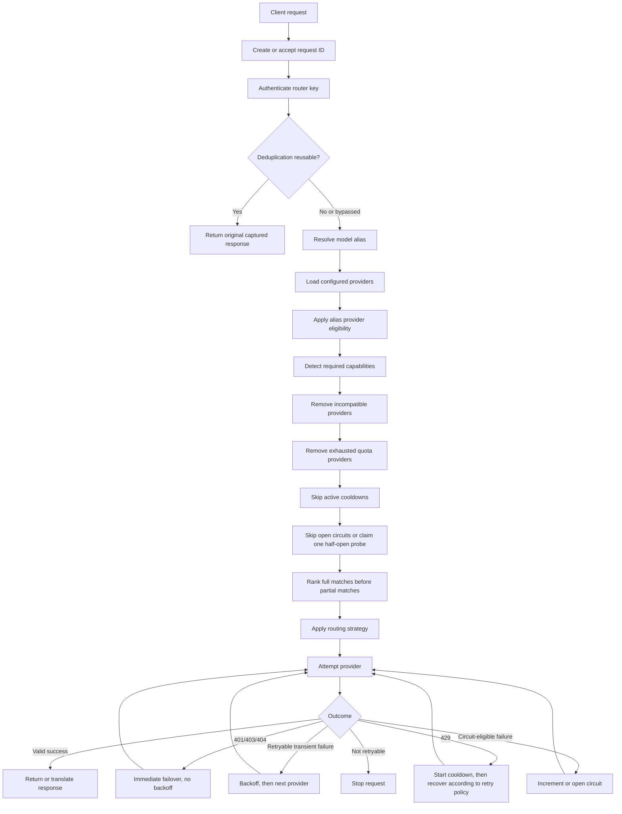
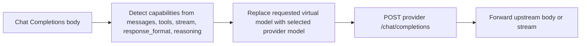
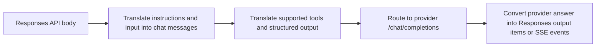
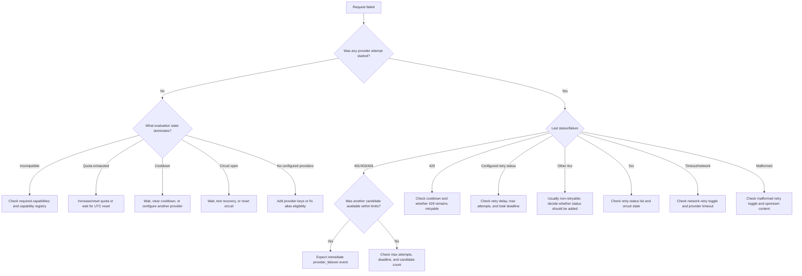

# Free LLM Router — Complete Routing Flow and Scenario Reference

> This document describes the behavior implemented in the current `llm-router-provider-failover-bug-fixed` build. It is a practical routing reference, not a description of every behavior that an upstream provider might implement internally.

## Table of contents

1. [Quick mental model](#1-quick-mental-model)
2. [Supported API surfaces](#2-supported-api-surfaces)
3. [Complete shared routing pipeline](#3-complete-shared-routing-pipeline)
4. [Model aliases](#4-model-aliases)
5. [Capability detection and matching](#5-capability-detection-and-matching)
6. [Current provider capability registry](#6-current-provider-capability-registry)
7. [Provider filtering and availability states](#7-provider-filtering-and-availability-states)
8. [Routing strategies and ranking](#8-routing-strategies-and-ranking)
9. [Provider-attempt lifecycle](#9-provider-attempt-lifecycle)
10. [HTTP status and recovery matrix](#10-http-status-and-recovery-matrix)
11. [Non-HTTP failure scenarios](#11-non-http-failure-scenarios)
12. [Cooldown behavior](#12-cooldown-behavior)
13. [Circuit-breaker behavior](#13-circuit-breaker-behavior)
14. [Quota behavior](#14-quota-behavior)
15. [Retry limits and stop conditions](#15-retry-limits-and-stop-conditions)
16. [Request deduplication](#16-request-deduplication)
17. [Streaming-specific behavior](#17-streaming-specific-behavior)
18. [Final router errors by API format](#18-final-router-errors-by-api-format)
19. [Request IDs, headers, logs, and Analysis](#19-request-ids-headers-logs-and-analysis)
20. [End-to-end scenario examples](#20-end-to-end-scenario-examples)
21. [Troubleshooting decision tree](#21-troubleshooting-decision-tree)
22. [Important current limitations](#22-important-current-limitations)

---

## 1. Quick mental model

Every inference request ultimately becomes an OpenAI-style upstream call to:

```text
<provider.baseUrl>/chat/completions
```

The incoming client may speak OpenAI Chat Completions, OpenAI Responses/Codex, or Anthropic Messages/Claude Code. The router normalizes those request formats, chooses a provider, and converts the result back into the caller's expected format.



### The most important distinction

In this project, **retry** normally means:

```text
Wait if required, then try the next ranked provider.
```

It does **not** normally mean calling the same provider twice during the same request.

There are two recovery modes:

| Recovery mode | Used for | Delay | Circuit penalty |
|---|---|---:|---:|
| Immediate provider failover | Provider-specific `401`, `403`, `404` | None | None |
| Retry with backoff | Configured transient statuses, network failures, timeouts, malformed responses | Yes | Sometimes |

---

## 2. Supported API surfaces

### 2.1 Inference and discovery routes

| Route | Client format | Authentication | Default model when omitted | Provider routing? |
|---|---|---|---|---:|
| `POST /v1/chat/completions` | OpenAI Chat Completions | `Authorization: Bearer <router-key>` | `free-router` | Yes |
| `POST /v1/responses` | OpenAI Responses / Codex | Bearer token or `x-api-key` | `codex-free-router` | Yes |
| `POST /v1/messages` | Anthropic Messages / Claude Code | Bearer token or `x-api-key` | `claude-free-router` | Yes |
| `POST /v1/messages/count_tokens` | Anthropic token estimate | Bearer token or `x-api-key` | Not applicable | No; local estimate |
| `GET /v1/models` | Model discovery | Optional | Not applicable | No |
| `HEAD /` | Claude Code connectivity check | None | Not applicable | No |
| `GET /health` | Health check | None | Not applicable | No |

### 2.2 OpenAI Chat Completions flow



Important behavior:

- The request body is largely forwarded as-is.
- The incoming `model` is replaced with the selected provider's configured model.
- The response is forwarded from the selected provider.
- This endpoint currently accepts the router key only through `Authorization: Bearer`.

### 2.3 OpenAI Responses / Codex flow



Supported routing-relevant inputs include:

- String or item-array `input`
- `instructions`
- Text and image content
- `stream`
- Function tools and tool choice
- Custom/freeform tools
- Structured JSON formats
- Reasoning fields

Hosted OpenAI-only tools, such as native provider-side web search, are not executed by this router. Unsupported hosted tools are omitted before forwarding to generic Chat Completions providers.

### 2.4 Anthropic Messages / Claude Code flow


Supported routing-relevant inputs include:

- Text and image content blocks
- System prompts
- Client tools and tool results
- Streaming
- Basic structured output translation
- Anthropic `thinking` object as a reasoning-capability signal

Exact Anthropic thinking semantics are not reproduced by generic OpenAI-compatible models, even though a `thinking` object causes the router to prefer reasoning-capable providers.

---

## 3. Complete shared routing pipeline

## 3.1 Request correlation

The router first reads `x-request-id`.

A client-provided value is accepted only when it:

- Is 1–128 characters
- Starts with an alphanumeric character
- Contains only letters, numbers, `.`, `_`, `:`, or `-`

If it is absent or invalid, the router generates:

```text
req_<32 hexadecimal characters>
```

The same request ID is used for:

- Authentication and routing events
- Every provider attempt
- Upstream `x-request-id`
- Response headers
- Structured error bodies
- Deduplication linkage
- Request Logs and Analysis

## 3.2 Authentication

Possible outcomes:

| Scenario | Result |
|---|---|
| Valid router key | Continue |
| Missing key | `401` authentication error |
| Unknown or invalid router key | `401` authentication error |
| Valid key but no provider keys configured | Later returns `400` configuration error |

Provider API keys are loaded only for the authenticated router/account.

## 3.3 JSON parsing

The request body is parsed before routing.

| Scenario | Result |
|---|---|
| Valid JSON object | Continue |
| Invalid JSON | `400 invalid_request_error` in the caller's API format |
| Body too large or body-read failure | Returned as a `400` request error by the current general error handler |

## 3.4 Request deduplication gate

Deduplication is considered only for:

- `POST /v1/chat/completions`
- `POST /v1/responses`
- `POST /v1/messages`

It runs after the router account and request body are available, but before provider routing.

See [Request deduplication](#16-request-deduplication) for all branches.

## 3.5 Model alias resolution

The router resolves the incoming `model` against enabled account aliases.

Default aliases:

| Endpoint | Default alias |
|---|---|
| Chat Completions | `free-router` |
| Responses / Codex | `codex-free-router` |
| Messages / Claude | `claude-free-router` |

An alias can override:

- Routing strategy
- Provider order
- Required capabilities
- Eligible provider IDs
- Provider timeout
- Total request deadline
- Maximum provider attempts
- Other reliability controls supported by alias overrides

### Current unknown-alias behavior

If the supplied model does not match an enabled alias, the current implementation does **not** return “model not found.” Instead:

- `alias` becomes undefined
- Router-wide strategy and provider order are used
- No alias-specific capability or eligibility rules are applied
- The requested model name is still preserved in response metadata

This is important when troubleshooting typos in custom alias names.

## 3.6 Provider loading

A provider enters the initial pool only when:

1. It exists in `providers.json`
2. It is not explicitly disabled
3. Its API key is available for the current router or configured environment

A provider with a missing required key is skipped before routing.

## 3.7 Alias eligibility restriction

If an alias has `eligibleProviderIds`, every provider not in that list is removed.

Example:

```json
{
  "id": "vision-router",
  "eligibleProviderIds": ["mistral", "github-models"]
}
```

Even a healthy Groq provider will not be considered for this alias.

## 3.8 Capability requirements

The router detects requirements from the original client body, then merges alias-required capabilities.

```text
Final requirements = automatically detected requirements + alias requirements
```

## 3.9 Health and capacity checks

For each compatible provider, the router checks:

1. Quota exhaustion
2. Active rate-limit cooldown
3. Circuit state
4. Half-open recovery eligibility

## 3.10 Ranking

The router applies this hierarchy:

1. One successfully claimed half-open recovery probe, if available
2. Full capability matches
3. Partial capability matches
4. Providers below quota warning threshold
5. Providers at quota warning threshold
6. Selected routing strategy

## 3.11 Attempt and recovery

Each candidate is attempted at most once during a single routed request.

Before each attempt, the router checks:

- Maximum provider attempts
- Remaining total request deadline
- Provider-specific timeout
- Streaming connection timeout
- Half-open probe timeout

The provider receives:

```http
POST <baseUrl>/chat/completions
Content-Type: application/json
Accept: application/json, text/event-stream
Authorization: Bearer <provider-key>
x-request-id: <router-request-id>
```

---

## 4. Model aliases

## 4.1 Required default aliases

Every router contains:

- `free-router`
- `codex-free-router`
- `claude-free-router`

They inherit router-wide policy by default.

## 4.2 Alias routing scenarios

| Alias setting | Effect |
|---|---|
| `routingStrategy: inherit` | Use router-wide strategy |
| Explicit strategy | Override router-wide strategy |
| Empty `providerOrder` | Use router-wide order |
| Non-empty `providerOrder` | Use alias-specific order |
| Empty `eligibleProviderIds` | All configured providers remain eligible |
| Non-empty `eligibleProviderIds` | Only listed providers remain eligible |
| `requiredCapabilities` | Added to automatically detected requirements |
| Reliability overrides | Override router defaults for this alias |
| Disabled custom alias | It will not resolve; current behavior falls back to no alias |

## 4.3 Example alias

```json
{
  "id": "strict-json-router",
  "name": "Strict JSON Router",
  "enabled": true,
  "routingStrategy": "reliability",
  "requiredCapabilities": ["structuredOutputs"],
  "eligibleProviderIds": ["mistral", "github-models"],
  "providerOrder": ["mistral", "github-models"],
  "reliabilityOverrides": {
    "providerTimeoutMs": 15000,
    "totalRequestTimeoutMs": 30000,
    "maxProviderAttempts": 2
  }
}
```

Flow:

```text
Request uses strict-json-router
→ require structuredOutputs
→ only Mistral and GitHub Models are eligible
→ full matches are ranked
→ reliability strategy chooses the first attempt
→ maximum two providers may be attempted
```

---

## 5. Capability detection and matching

## 5.1 Supported capability names

| Capability | Meaning |
|---|---|
| `streaming` | Provider can return a streamed response |
| `tools` | Provider supports function/tool calls |
| `jsonMode` | Provider supports JSON-object response mode |
| `structuredOutputs` | Provider supports schema-constrained JSON output |
| `vision` | Provider can process image input |
| `reasoning` | Provider/model supports reasoning-oriented controls |
| `embeddings` | Provider/model supports embeddings |
| `contextWindow` | Numeric metadata used when a minimum context requirement is provided |
| `maxOutputTokens` | Informational provider metadata; not currently used as a hard routing filter |

## 5.2 Automatic detection rules

| Request content | Required capability |
|---|---|
| `stream: true` | `streaming` |
| Non-empty `tools` array | `tools` |
| Image content inside `messages` or `input` | `vision` |
| `response_format.type: json_object` | `jsonMode` |
| `response_format.type: json_schema` | `structuredOutputs` |
| Responses `text.format.type: json_schema` | `structuredOutputs` |
| `output_config.format.type: json_schema` | `structuredOutputs` |
| A `reasoning` object | `reasoning` |
| A string `reasoning_effort` | `reasoning` |
| An Anthropic `thinking` object | `reasoning` |

### Image detection recognizes

- `type: image`
- `type: image_url`
- `type: input_image`
- An `image_url` property
- Anthropic-style image `source` objects
- Nested image content inside arrays and objects

## 5.3 Capabilities not automatically requested today

### Embeddings

The registry contains `embeddings`, but the project does not currently expose `/v1/embeddings`. No current inference request automatically adds the embeddings requirement.

### Minimum context window

The matching engine supports `minimumContextTokens`, but normal request processing does not currently estimate prompt length and populate that requirement automatically.

### Maximum output tokens

`maxOutputTokens` is shown as registry metadata but is not currently used to reject a provider when a request asks for a larger output.

## 5.4 Match levels

Every provider gets one of three capability-match levels:

| Match | Meaning | Routing behavior |
|---|---|---|
| `full` | Every required capability is explicitly supported | Ranked first |
| `partial` | Nothing is explicitly unsupported, but one or more requirements are unknown | Remains eligible, ranked after all full matches |
| `incompatible` | At least one requirement is explicitly unsupported, or context is known to be too small | Removed before provider calls |

Unknown support is deliberately conservative:

```text
unknown ≠ unsupported
```

The router may still try a provider with unknown support after all verified full matches.

## 5.5 Capability examples

### Example A — simple text request

```json
{
  "model": "free-router",
  "messages": [{"role": "user", "content": "Hello"}]
}
```

Automatically required capabilities:

```text
none
```

All configured providers are capability-compatible.

### Example B — streamed tool request

```json
{
  "stream": true,
  "tools": [{"type": "function", "function": {"name": "get_weather"}}],
  "messages": [{"role": "user", "content": "Weather?"}]
}
```

Required:

```text
streaming + tools
```

### Example C — vision plus strict schema

```json
{
  "messages": [
    {
      "role": "user",
      "content": [
        {"type": "image_url", "image_url": {"url": "https://example.com/a.png"}},
        {"type": "text", "text": "Describe this"}
      ]
    }
  ],
  "response_format": {
    "type": "json_schema",
    "json_schema": {"name": "description", "schema": {"type": "object"}}
  }
}
```

Required:

```text
vision + structuredOutputs
```

### Example D — Claude thinking request

```json
{
  "model": "claude-free-router",
  "thinking": {"type": "enabled", "budget_tokens": 1024},
  "messages": [{"role": "user", "content": "Solve this carefully"}]
}
```

Required:

```text
reasoning
```

---

## 6. Current provider capability registry

Legend:

- ✅ Supported
- ❌ Unsupported
- ? Unknown

Provider configuration can override these registry values.

| Provider ID | Streaming | Tools | JSON mode | Structured output | Vision | Reasoning | Embeddings | Context window | Max output |
|---|---:|---:|---:|---:|---:|---:|---:|---:|---:|
| `openrouter-qwen` | ✅ | ✅ | ✅ | ? | ❌ | ❌ | ❌ | 262,144 | — |
| `groq-llama` | ✅ | ✅ | ✅ | ? | ❌ | ? | ❌ | 131,072 | 32,768 |
| `nvidia-nemotron` | ✅ | ✅ | ? | ? | ❌ | ✅ | ❌ | 1,048,576 | — |
| `cerebras-gpt-oss` | ✅ | ✅ | ✅ | ? | ❌ | ✅ | ❌ | 131,072 | — |
| `mistral` | ✅ | ✅ | ✅ | ✅ | ✅ | ✅ | ❌ | 262,144 | — |
| `aion` | ✅ | ? | ? | ? | ❌ | ? | ❌ | — | — |
| `zai` | ✅ | ✅ | ? | ? | ❌ | ✅ | ❌ | 131,072 | — |
| `github-models` | ✅ | ✅ | ✅ | ✅ | ✅ | ❌ | ❌ | 1,047,576 | 32,768 |
| `hugging-face` | ✅ | ? | ? | ? | ❌ | ❌ | ❌ | 131,072 | — |
| `kilo-code` | ✅ | ? | ? | ? | ? | ? | ❌ | — | — |
| `modelscope` | ✅ | ✅ | ? | ? | ❌ | ✅ | ❌ | 262,144 | — |
| `sambanova` | ✅ | ? | ? | ? | ❌ | ? | ❌ | 131,072 | — |
| `siliconflow` | ✅ | ✅ | ? | ? | ❌ | ✅ | ❌ | 40,960 | — |

### Important matrix consequences

- A vision request currently has verified full matches only on `mistral` and `github-models`; `kilo-code` is partial because vision is unknown.
- A strict structured-output request has verified full matches on `mistral` and `github-models`; providers marked `?` remain partial.
- A reasoning request can fully match NVIDIA, Cerebras, Mistral, Z AI, ModelScope, and SiliconFlow.
- Embeddings are marked unsupported for every current registry entry.

---

## 7. Provider filtering and availability states

Every provider is assigned one Analysis evaluation state.

| State | Meaning | Upstream call made? |
|---|---|---:|
| `candidate` | Eligible and ranked | Possibly |
| `incompatible` | Explicit capability mismatch | No |
| `quota-exhausted` | At least one configured limit reached | No |
| `cooldown` | Rate-limit cooldown still active | No |
| `circuit-open` | Circuit protection window active | No |
| `half-open` | Selected as the single recovery probe | Yes, first candidate |

## 7.1 Filtering order

```text
Configured and enabled
→ alias eligibility
→ capability compatibility
→ quota availability
→ cooldown availability
→ circuit availability
→ ranking
```

## 7.2 Full matches versus partial matches

Even if a partial-match provider has higher priority or better latency, every full match is ranked before it.

Example:

```text
Mistral: full vision match, priority 5
Kilo: partial vision match, priority 1
```

Result:

```text
Mistral is attempted before Kilo.
```

## 7.3 Quota warning behavior

A provider that crosses its warning threshold is not skipped. It is moved behind non-warning providers in the same capability pool.

Among warning providers, the provider with more remaining quota is preferred.

---

## 8. Routing strategies and ranking

The base provider order comes from:

1. Alias-specific `providerOrder`, when present
2. Router-wide `providerOrder`
3. Provider `priority` in `providers.json`
4. Original provider configuration order

## 8.1 Priority

```text
Use the saved provider order exactly, then fall back to numeric provider priority.
```

Default configured priority order:

| Rank | Provider | Model |
|---:|---|---|
| 1 | `openrouter-qwen` | `qwen/qwen3-coder:free` |
| 2 | `groq-llama` | `llama-3.3-70b-versatile` |
| 3 | `nvidia-nemotron` | `nvidia/nemotron-3-super-120b-a12b` |
| 4 | `cerebras-gpt-oss` | `gpt-oss-120b` |
| 5 | `mistral` | `mistral-small-2603` |
| 6 | `aion` | `aion-2.5` |
| 7 | `zai` | `glm-4.7-flash` |
| 8 | `github-models` | `openai/gpt-4.1-mini` |
| 9 | `hugging-face` | `meta-llama/Meta-Llama-3.1-8B-Instruct` |
| 10 | `kilo-code` | `kilo-auto/free` |
| 11 | `modelscope` | `Qwen/Qwen3.5-35B-A3B` |
| 12 | `sambanova` | `Meta-Llama-3.3-70B-Instruct` |
| 13 | `siliconflow` | `Qwen/Qwen3-8B` |

Only providers with configured keys and eligible health/capability state appear in the actual candidate list.

## 8.2 Round robin

- Starts from the priority-ordered base list
- Rotates the starting provider using a persistent cursor
- Cursor scope is per router and per alias

Example:

```text
Request 1: A → B → C
Request 2: B → C → A
Request 3: C → A → B
```

## 8.3 Least used

Order by:

1. Fewest historical attempts
2. Oldest `lastUsedAt`
3. Priority order

## 8.4 Fastest

Order by:

1. Providers with fewer than two samples receive exploration priority
2. Lowest observed average latency
3. Priority order

## 8.5 Reliability

Order by:

1. Providers with fewer than two samples receive exploration priority
2. Highest success score
3. Lowest average latency
4. Priority order

## 8.6 Smart

Smart ranking combines:

- 42% reliability
- 20% latency score
- 12% lower historical usage
- 18% remaining quota
- 8% priority position
- Exploration bonus for providers with fewer than two samples
- Penalty for consecutive failures

The exact score is internal, but the goal is to balance reliability, speed, capacity, and distribution.

---

## 9. Provider-attempt lifecycle

## 9.1 Timeout selection

Timeout precedence:

```text
Half-open probe timeout
→ per-provider timeout override
→ provider-specific timeout in providers.json
→ streaming connection timeout when stream=true
→ normal provider timeout
```

The selected timeout is capped by the remaining total request deadline.

Default values:

| Setting | Default |
|---|---:|
| Provider timeout | 30,000 ms |
| Streaming connection timeout | 30,000 ms |
| Half-open probe timeout | 10,000 ms |
| Total request deadline | 90,000 ms |
| Maximum provider attempts | 3 |
| Initial backoff | 250 ms |
| Maximum backoff | 3,000 ms |
| Backoff multiplier | 2 |
| Jitter | Enabled |

## 9.2 Successful response validation

### Non-streaming

If the response declares `Content-Type: application/json`, the router verifies that:

- JSON can be parsed
- Parsed JSON is a non-null object

If the content type is not JSON, the router currently accepts the successful response without JSON validation.

### Streaming

A successful upstream streaming response is accepted when it has a response body.

An empty streaming body is treated as malformed.

## 9.3 Successful attempt

A valid successful response:

- Resets rate-limit failure count
- Closes and clears the provider circuit
- Records the attempt as successful
- Returns the selected provider ID and capability match
- Captures token usage when available
- Builds timing and routing headers
- Stores the request in Request Logs and Analysis

---

## 10. HTTP status and recovery matrix

## 10.1 Default retry-status configuration

```json
[408, 409, 425, 429, 500, 502, 503, 504]
```

The list can contain up to 40 unique status codes from `400` through `599`.

## 10.2 Exact upstream status behavior

| Upstream status | Default router action | Backoff? | Cooldown? | Circuit penalty? | Notes |
|---:|---|---:|---:|---:|---|
| `200–299` valid | Return success | No | No | No | Subject to malformed-response validation |
| `200–299` malformed | Try next provider when malformed retry is enabled | Yes | No | Yes | Empty stream, invalid JSON, or non-object JSON |
| `301–399` | Usually followed automatically by `fetch` | — | — | — | Final response status is what routing sees |
| `400` | Stop | No | No | No | Considered a client/request error by default |
| `401` | Immediate next provider | No | No | No | Provider credential rejected |
| `402` | Stop unless added to retry codes | Configurable | No | No | Generic provider/client status |
| `403` | Immediate next provider | No | No | No | Provider access denied |
| `404` | Immediate next provider | No | No | No | Provider model or endpoint unavailable |
| `405–407` | Stop unless configured retryable | Configurable | No | No | Generic non-success status |
| `408` | Next provider with backoff | Yes | No | Yes | Classified as timeout |
| `409` | Next provider with backoff | Yes | No | No | Default retry status |
| `410–424` except configured codes | Stop unless configured retryable | Configurable | No | No | `425` is retryable by default |
| `425` | Next provider with backoff | Yes | No | No | Default retry status |
| `426–428` | Stop unless configured retryable | Configurable | No | No | Generic non-success status |
| `429` | Start cooldown; normally next provider with backoff | Usually | Yes | No | Honors `Retry-After` |
| `430–499` | Stop unless configured retryable | Configurable | No | No | Generic 4xx behavior |
| `500` | Next provider with backoff | Yes | No | Yes | Server error |
| `501` | Stop by default, but circuit failure is recorded | No by default | No | Yes | Add `501` to retry codes to continue |
| `502` | Next provider with backoff | Yes | No | Yes | Server error |
| `503` | Next provider with backoff | Yes | No | Yes | Server error |
| `504` | Next provider with backoff | Yes | No | Yes | Server error |
| `505–599` | Stop by default unless configured, but circuit failure is recorded | Configurable | No | Yes | Every 5xx is circuit-eligible |

## 10.3 Immediate failover statuses

These statuses always use provider-specific immediate failover logic:

```text
401 → provider_authentication_failed
403 → provider_access_denied
404 → provider_model_or_endpoint_unavailable
```

They do not depend on `retryStatusCodes`.

Example:

```text
OpenRouter 404
→ record failed attempt
→ no backoff
→ no cooldown
→ no circuit failure
→ immediately attempt Groq
```

Immediate failover still stops when:

- Maximum attempts has been reached
- There are no more candidates
- The total request deadline has expired

## 10.4 Configured retry statuses

For any non-special HTTP status:

```text
status is in retryStatusCodes
→ retryable
→ calculate backoff
→ attempt next candidate
```

If it is not in the list:

```text
status is not retryable
→ stop the routed request
```

### Important nuance for 5xx

Every `5xx` is classified as a circuit-eligible server failure, even if that exact status is not in `retryStatusCodes`.

Therefore a `501` can:

- Increment circuit failure state
- Stop the current request immediately by default

## 10.5 `429` behavior when removed from retry codes

A `429` always creates a cooldown. However, if `429` is removed from `retryStatusCodes`, the current request will stop after creating the cooldown rather than moving to the next candidate.

---

## 11. Non-HTTP failure scenarios

| Failure | Default action | Backoff? | Circuit penalty? |
|---|---|---:|---:|
| Provider timeout | Try next provider when network retries enabled | Yes | Yes |
| DNS failure | Try next provider when network retries enabled | Yes | Yes |
| Connection refused/reset | Try next provider when network retries enabled | Yes | Yes |
| Socket/network fetch failure | Try next provider when network retries enabled | Yes | Yes |
| Invalid successful JSON | Try next provider when malformed retry enabled | Yes | Yes |
| Successful JSON that is not an object | Try next provider when malformed retry enabled | Yes | Yes |
| Empty successful streaming body | Try next provider when malformed retry enabled | Yes | Yes |
| Client abort before provider timeout | Abort request | No | No routed recovery |
| Abort during retry delay | Abort request | No | No further provider |
| Total request deadline expires | Stop | No | Recorded as deadline stop |

### Network retry toggle

When `retryNetworkErrors` is false:

- The provider failure is still recorded
- Circuit failure state may still increase
- The current routed request stops instead of trying the next provider

### Malformed-response retry toggle

When `retryMalformedResponses` is false:

- The malformed response is recorded
- Circuit failure state may still increase
- The current routed request stops

---

## 12. Cooldown behavior

A cooldown is created only for upstream `429` responses.

## 12.1 `Retry-After`

The router accepts:

- Numeric seconds
- HTTP-date format

The parsed value is capped at 24 hours.

## 12.2 Fallback cooldown sequence

When `Retry-After` is missing or shorter than the router's fallback, the cooldown grows approximately as:

```text
30 seconds
1 minute
2 minutes
5 minutes
10 minutes
15 minutes
```

The effective cooldown uses the longer of:

- Parsed `Retry-After`
- Calculated fallback cooldown

## 12.3 During cooldown

- Provider is skipped before an upstream call
- Analysis state is `cooldown`
- `cooldownUntil` is recorded
- Other healthy providers may still serve requests

## 12.4 When all compatible providers are cooling down

Router response:

```text
HTTP 429
error type/code: providers_cooling_down
Retry-After: <seconds>
x-free-llm-cooldown-until: <ISO timestamp>
```

---

## 13. Circuit-breaker behavior

Circuit-eligible failure types:

- Any upstream `5xx`
- HTTP `408`
- Provider timeout
- Connection/network failure
- Malformed successful response

Provider-specific `401`, `403`, and `404` do not damage the circuit.

## 13.1 Closed state

Normal requests are allowed.

Each circuit-eligible failure increments `circuitFailureCount`.

## 13.2 Opening threshold

The circuit opens after three consecutive circuit-eligible failures.

Open durations escalate:

```text
First open: 2 minutes
Second open: 5 minutes
Third open: 10 minutes
Later opens: 15 minutes
```

## 13.3 Open state

- Provider is skipped
- No upstream request is made
- Other providers continue serving traffic

## 13.4 Half-open state

After `circuitOpenUntil` passes:

1. The router tries to claim a single recovery probe
2. The claimed provider is placed first in the candidate list
3. It uses the half-open probe timeout

Only one concurrent request should own the probe.

## 13.5 Half-open success

- Circuit closes
- Failure count resets
- Open count resets
- Provider returns to normal service

## 13.6 Half-open failure

- Circuit immediately reopens
- Open duration advances to the next window
- Request may continue to the next provider when recovery policy allows

## 13.7 All providers unavailable due to circuits or mixed health states

If no candidate exists because providers are in cooldown/open/half-open states, the router returns:

```text
HTTP 503
providers_unavailable
Retry-After: <seconds>
x-free-llm-retry-at: <ISO timestamp>
```

---

## 14. Quota behavior

A provider may have any combination of:

- Daily request limit
- Monthly request limit
- Daily token limit
- Monthly token limit
- Warning threshold percentage

## 14.1 Usage accounting

Every actual upstream attempt increments:

- Requests
- Successful requests or failed requests

A successful response also records:

- Input tokens
- Output tokens
- Total tokens
- Usage source: `reported` or `estimated`

Deduplicated responses do not create a second provider attempt or duplicate provider token usage.

## 14.2 Warning state

When the most-consumed configured limit reaches the warning threshold:

- Provider remains eligible
- Provider moves behind non-warning providers in the same match pool
- Remaining quota affects warning-provider ordering

## 14.3 Exhausted state

A provider is exhausted when any configured limit reaches or exceeds its limit.

It is skipped before an upstream call.

Possible exhausted limits:

- `daily_requests`
- `monthly_requests`
- `daily_tokens`
- `monthly_tokens`

## 14.4 Automatic resets

- Daily windows reset at the next UTC day
- Monthly windows reset at the first day of the next UTC month

## 14.5 All compatible providers exhausted

Router response:

```text
HTTP 429
providers_quota_exhausted
Retry-After: <seconds>
x-free-llm-quota-reset-at: <ISO timestamp>
```

---

## 15. Retry limits and stop conditions

## 15.1 Maximum attempts

Default:

```text
3 provider attempts per client request
```

If ten providers are ranked but `maxProviderAttempts` is 3, only the first three may be called.

Stop reason:

```text
maximum_attempts_reached
```

## 15.2 No more candidates

The router stops when the current provider is the last candidate.

Stop reason:

```text
no_more_candidates
```

## 15.3 Total request deadline

The deadline includes:

- Router preparation
- Provider calls
- Retry backoff delays
- Failover attempts

Before each provider attempt, the provider timeout is shortened to the remaining deadline when necessary.

Stop reason:

```text
total_request_deadline_exceeded
```

## 15.4 Non-retryable failure

A generic status not configured as retryable causes:

```text
error_not_retryable
```

This does not apply to the special immediate-failover statuses `401`, `403`, and `404`.

## 15.5 Backoff formula

Before jitter:

```text
min(maxBackoffMs, initialBackoffMs × multiplier^(attemptNumber - 1))
```

With jitter enabled, the delay is randomized to approximately 50%–150% of the calculated base.

Example defaults:

```text
Attempt 1 failure → about 125–375 ms
Attempt 2 failure → about 250–750 ms
Attempt 3 failure → about 500–1500 ms
```

No backoff is used for immediate provider failover.

---

## 16. Request deduplication

## 16.1 Default settings

```json
{
  "enabled": true,
  "windowMs": 30000,
  "automaticFingerprinting": true,
  "requireIdempotencyKey": false,
  "bypassToolRequests": true,
  "bypassMultimodalRequests": true,
  "bypassNonDeterministicRequests": true
}
```

## 16.2 Fingerprint scope

Automatic fingerprints include:

- Hashed router identity
- API endpoint
- Canonical request body
- Default model for the endpoint when model is absent

This prevents cross-account deduplication.

## 16.3 Explicit idempotency key

Clients may send:

```http
Idempotency-Key: operation-123
```

The key must be no longer than 200 characters.

An explicit key overrides conservative tool, multimodal, and non-deterministic bypass rules. Streaming is still always bypassed.

## 16.4 Automatic bypass scenarios

| Scenario | Bypass reason |
|---|---|
| Deduplication disabled | `disabled` |
| Streaming request | `streaming_request` |
| Key required but absent | `idempotency_key_required` |
| Automatic fingerprinting disabled and no key | `automatic_fingerprinting_disabled` |
| Tool request | `tool_request` |
| Image/audio/file input | `multimodal_request` |
| Temperature above zero, restricted `top_p`, or multiple candidates | `non_deterministic_request` |

## 16.5 In-flight coalescing

```text
Client A starts request
Client B sends identical request before A finishes
→ B waits for A's captured result
→ only one provider operation occurs
```

Deduplication source:

```text
in-flight
```

## 16.6 Completed-response reuse

Successful `2xx` responses up to 2 MB are retained for the configured window.

A later duplicate receives the captured response without a provider call.

Deduplication source:

```text
completed
```

## 16.7 Responses not reused

- Failed responses
- Non-2xx responses
- Captured bodies above 2 MB
- Streaming responses

---

## 17. Streaming-specific behavior

## 17.1 Before the stream is accepted

Provider failover can occur when:

- Connection cannot be established
- Provider returns an HTTP failure
- Successful response has no stream body
- Provider connection timeout expires

## 17.2 After the stream begins

Once a provider returns a successful response with a body and the router starts sending data to the client, it cannot safely switch providers mid-stream.

Therefore:

```text
Failure before stream acceptance → provider failover may happen
Failure after client stream begins → stream ends or emits an API-format error; no provider switch
```

## 17.3 API-specific late stream errors

### Responses / Codex

If headers have not been sent:

```text
HTTP 502 api_error / upstream_error
```

If streaming has already started:

```text
event: error
```

### Anthropic Messages

If headers have not been sent:

```text
HTTP 502 anthropic api_error
```

If streaming has already started:

```text
Anthropic error event in the SSE stream
```

### Chat Completions

The upstream stream is piped directly. A late stream failure ends the stream; routing does not restart on another provider.

## 17.4 Streaming and deduplication

Streaming is always excluded from deduplication because an active stream cannot be safely replayed by the current implementation.

---

## 18. Final router errors by API format

All structured errors include the request ID.

## 18.1 Error mapping table

| Routing outcome | HTTP | Chat Completions | Responses / Codex | Anthropic Messages |
|---|---:|---|---|---|
| Missing/invalid router key | 401 | `authentication_error` | `authentication_error`, code `invalid_api_key` | `authentication_error` |
| Invalid JSON/request parsing | 400 | `invalid_request_error` | `invalid_request_error` | `invalid_request_error` |
| No configured/eligible provider keys | 400 | `configuration_error` | `configuration_error`, code `providers_not_configured` | `invalid_request_error` |
| No capability-compatible provider | 400 | `no_compatible_provider` | `invalid_request_error`, code `no_compatible_provider` | `invalid_request_error` |
| All compatible providers quota-exhausted | 429 | `providers_quota_exhausted` | `rate_limit_error`, code `providers_quota_exhausted` | `rate_limit_error` |
| All compatible providers cooling down | 429 | `providers_cooling_down` | `rate_limit_error`, code `providers_cooling_down` | `rate_limit_error` |
| Providers blocked by cooldown/circuit mixture | 503 | `providers_unavailable` | `server_error`, code `providers_unavailable` | `api_error` |
| Attempted providers all failed or recovery stopped | 503 | `providers_exhausted` | `providers_exhausted` | `overloaded_error` |
| Other adapter/request error | Usually 400 | `invalid_request_error` | `invalid_request_error` | `invalid_request_error` |
| Late Responses stream conversion failure | 502 or SSE error | Not applicable | `api_error`, code `upstream_error` | Not applicable |
| Late Anthropic stream conversion failure | 502 or SSE error | Not applicable | Not applicable | `api_error` |

## 18.2 `no_compatible_provider` details

The error includes:

- Required capabilities
- Every considered provider
- Supported, unknown, and unsupported capability details

## 18.3 `providers_exhausted` details

The error includes attempted providers and may include:

- Upstream status
- Safe provider error message
- Whether the error was retryable
- Recovery action
- Immediate failover reason
- Retry stop reason

---

## 19. Request IDs, headers, logs, and Analysis

## 19.1 Common success headers

```text
x-free-llm-request-id
x-free-llm-request-id-source
x-free-llm-client-request-id
x-free-llm-provider
x-free-llm-provider-model
x-free-llm-requested-model
x-free-llm-model-alias
x-free-llm-routing-strategy
x-free-llm-routing-policy
x-free-llm-required-capabilities
x-free-llm-capability-match
x-free-llm-provider-attempts
x-free-llm-fallback-used
x-free-llm-total-latency-ms
x-free-llm-router-latency-ms
x-free-llm-provider-latency-ms
x-free-llm-retry-delay-ms
x-free-llm-deduplicated
```

Conditional headers can include:

- Cooldown state and reset time
- Circuit state
- Quota warning/reset information
- Retry stop reason
- First-token and stream timing
- Deduplication source and original request ID

## 19.2 Analysis timeline events

The timeline may include:

- `request_received`
- `authentication_succeeded`
- `alias_resolved`
- `routing_started`
- `provider_ranked`
- `provider_skipped`
- `provider_attempt_started`
- `provider_attempt_succeeded`
- `provider_attempt_failed`
- `provider_failover`
- `retry_scheduled`
- `retry_stopped`
- `cooldown_started`
- `circuit_state_changed`
- `deduplication_reused`
- `response_returned`
- `request_failed`

## 19.3 What to inspect when failover does not happen

Check the failed attempt for:

```text
recoveryAction
failoverReason
retryable
retryStopReason
attemptNumber
providerTimeoutMs
retryDelayMs
```

Typical explanations:

| Timeline text | Meaning |
|---|---|
| Immediate failover to next provider | `401`, `403`, or `404`; next candidate should start immediately |
| Retrying stopped because failure is not configured as retryable | Generic status not in `retryStatusCodes` |
| Maximum attempts reached | Attempt budget exhausted |
| Total request deadline exceeded | No time remains for another provider |
| No more candidates | Every ranked candidate has already been attempted or skipped |

---

## 20. End-to-end scenario examples

## Scenario 1 — First provider succeeds

```text
Request: free-router, text only
Candidates: OpenRouter, Groq, Mistral
OpenRouter: 200 valid JSON
Result: return OpenRouter response
Attempts: 1
Fallback used: false
```

## Scenario 2 — OpenRouter model `404`, Groq succeeds

```text
OpenRouter: 404 model unavailable
→ immediate_failover
→ no delay
→ no circuit penalty
Groq: 200
Result: success from Groq
Attempts: 2
Fallback used: true
```

Expected timeline:

```text
OpenRouter failed — HTTP 404
Immediate failover to next provider
Groq attempt started
Groq succeeded
```

## Scenario 3 — Provider key rejected

```text
Provider A: 401
→ provider_authentication_failed
→ immediate next provider
Provider B: 200
```

The router succeeds, but Provider A's key should be corrected later.

## Scenario 4 — Provider access denied

```text
Provider A: 403
→ provider_access_denied
→ immediate next provider
```

No backoff or circuit penalty is applied.

## Scenario 5 — Rate limit with `Retry-After`

```text
Groq: 429 Retry-After: 60
→ cooldown Groq until at least 60 seconds later
→ schedule configured backoff
→ try Mistral
Mistral: 200
```

Future requests skip Groq until cooldown expires.

## Scenario 6 — Three repeated `503` failures open a circuit

Across requests:

```text
Failure 1: circuit count 1
Failure 2: circuit count 2
Failure 3: circuit opens for 2 minutes
```

Later requests skip that provider until its recovery window.

## Scenario 7 — Half-open recovery succeeds

```text
Circuit window expires
→ one request claims recovery probe
→ provider is candidate #1
→ provider returns 200
→ circuit closes and resets
```

## Scenario 8 — Half-open recovery fails

```text
Recovery probe returns 503
→ circuit immediately reopens
→ longer open duration
→ router may continue to next provider
```

## Scenario 9 — Vision request

Required:

```text
vision
```

Example evaluation:

```text
Mistral: full
GitHub Models: full
Kilo: partial
Groq: incompatible
OpenRouter Qwen: incompatible
```

The router attempts full matches before Kilo.

## Scenario 10 — Strict structured-output request

Required:

```text
structuredOutputs
```

Mistral and GitHub Models are full matches. Providers with unknown support are partial. Explicitly unsupported providers are removed.

## Scenario 11 — Every provider capability-incompatible

```text
Request requires embeddings
Current registry marks all providers unsupported
→ no provider attempt
→ HTTP 400 no_compatible_provider
```

## Scenario 12 — Quota warning

```text
Groq at 85% of configured limit, warning threshold 80%
Mistral at 20%
Both full capability matches
→ Mistral ranked before Groq
```

## Scenario 13 — All quotas exhausted

```text
Every compatible provider reaches at least one hard limit
→ no upstream attempt
→ HTTP 429 providers_quota_exhausted
```

## Scenario 14 — Non-retryable `422`

Default behavior:

```text
Provider A: 422
→ not in retryStatusCodes
→ retrying stopped
→ HTTP 503 providers_exhausted
```

If `422` is added to retry status codes:

```text
Provider A: 422
→ backoff
→ next provider
```

Use this carefully. A `422` may indicate a request that every provider will reject.

## Scenario 15 — `501` response

Default behavior:

```text
Provider A: 501
→ circuit-eligible server failure recorded
→ 501 is not in default retry codes
→ current request stops
```

Adding `501` to retry codes allows the next provider to be attempted.

## Scenario 16 — Provider timeout

```text
Provider A exceeds its selected timeout
→ timeout failure
→ increment circuit failure state
→ backoff
→ attempt Provider B
```

If network retries are disabled, the request stops after Provider A.

## Scenario 17 — Total deadline prevents fallback

```text
Total deadline: 5 seconds
Provider A consumes 4.9 seconds
Calculated backoff or next attempt would cross deadline
→ stop reason total_request_deadline_exceeded
```

## Scenario 18 — Maximum attempt budget prevents fallback

```text
10 ranked providers
maxProviderAttempts: 2
Provider 1 fails
Provider 2 fails
→ Provider 3 is never called
→ stop reason maximum_attempts_reached
```

## Scenario 19 — Malformed successful response

```text
Provider returns HTTP 200 application/json
Body is invalid JSON
→ malformed_response
→ circuit failure recorded
→ backoff and next provider when enabled
```

## Scenario 20 — Duplicate non-streaming request

```text
Client A starts request
Client B sends identical request
→ one upstream call
→ B receives in-flight reused result
→ quota/attempt usage counted once
```

## Scenario 21 — Duplicate streaming request

```text
stream: true
→ deduplication bypassed
→ each client gets its own routed provider request
```

## Scenario 22 — Stream fails after data starts

```text
Provider accepted and client received initial chunks
Later upstream stream errors
→ router cannot switch provider mid-response
→ stream ends or API-format error event is emitted
```

## Scenario 23 — No provider keys configured

```text
Authentication succeeds
No configured provider remains after provider-key loading
→ HTTP 400 configuration error
```

## Scenario 24 — Alias restricts all configured providers

```text
Alias allows only Mistral
User configured only Groq
→ no provider remains
→ HTTP 400 configuration error
```

## Scenario 25 — Unknown alias typo

```text
model: vison-router
Actual alias: vision-router
```

Current behavior:

```text
Alias is not resolved
→ router-wide policy is used
→ no vision alias requirement is added
```

This can produce surprising routing. Check `x-free-llm-model-alias`, which will show `none`.

---

## 21. Troubleshooting decision tree



### Fast checklist

1. Was the next provider marked `candidate` or was it skipped?
2. Was the failed status `401`, `403`, or `404`?
3. If not, is the status in `retryStatusCodes`?
4. Did `maxProviderAttempts` already run out?
5. Did the total deadline leave enough time for another attempt?
6. Was there another candidate after capability, quota, cooldown, and circuit filtering?
7. Did streaming already begin?
8. Did an alias restrict the eligible provider list?
9. Was the requested alias actually resolved?
10. Does the timeline show `retry_stopped`, `provider_failover`, or `provider_skipped`?

---

## 22. Important current limitations

1. **All upstream inference routes use `/chat/completions`.** Responses and Messages are adapters over Chat Completions providers.
2. **No `/v1/embeddings` route is implemented yet**, although embeddings exists in the capability type system.
3. **Unknown aliases are not rejected.** They currently use router-wide behavior with no alias-specific rules.
4. **Context-window requirements are not automatically estimated from prompt size.**
5. **Maximum output-token metadata is not enforced during ranking.**
6. **Unknown capability support remains eligible as a partial match.** This improves availability but can lead to an upstream feature rejection.
7. **A provider is attempted only once per routed request.** Recovery proceeds to the next candidate.
8. **Mid-stream provider failover is not possible after response data begins.**
9. **Deduplication is process-local and ephemeral.** Multi-instance deployments require sticky routing or a future shared coordinator.
10. **Removing a status from `retryStatusCodes` can stop cross-provider recovery for that status.** Special `401`, `403`, and `404` immediate failover remains active.
11. **Every 5xx is circuit-eligible even when it is not configured as retryable.**
12. **A `429` creates cooldown state even when `429` is removed from retry codes.**
13. **Anthropic compatibility is best-effort** when routing Claude Code to non-Claude OpenAI-compatible models.

---

## One-page routing summary

```text
1. Accept or generate request ID.
2. Authenticate router key.
3. Parse request body.
4. Reuse an identical request when safe, otherwise continue.
5. Resolve alias and merge alias policy/capabilities/reliability.
6. Load only configured provider keys.
7. Apply alias eligible-provider restriction.
8. Detect streaming/tools/vision/JSON/schema/reasoning requirements.
9. Remove explicit capability mismatches.
10. Remove hard quota exhaustion.
11. Skip active cooldowns.
12. Skip open circuits; optionally claim one half-open probe.
13. Rank full matches before partial matches.
14. Prefer non-warning quota providers.
15. Apply Priority/Fastest/Round robin/Least used/Reliability/Smart.
16. Attempt provider with selected timeout and shared request ID.
17. Valid 2xx → return.
18. 401/403/404 → immediate next provider, no backoff/circuit penalty.
19. Configured transient status → backoff, then next provider.
20. 429 → create cooldown; continue only when retry policy and limits allow.
21. 5xx/timeout/network/malformed → update circuit state.
22. Stop on non-retryable error, max attempts, no candidates, deadline, or client abort.
23. Return API-format-specific error and store the complete timeline.
```
