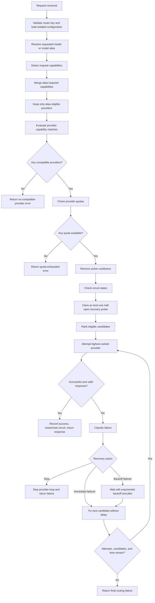

# Request Flow and Routing Logic

This document explains how **free-llm-router** handles a request from the moment it arrives until a provider returns a response or routing stops.

It is intentionally written in simple language first, with the exact technical behavior and source-code locations included afterward.

> **Version note:** This document describes the routing behavior in the reviewed `free-llm-router` v0.6.0 codebase.

---

## 1. The simplest explanation

Imagine a teacher has a package that must be delivered.

The available delivery drivers are AI providers such as:

- Google Gemini
- Mistral
- NVIDIA
- OpenRouter
- Groq
- Other configured providers

The teacher does not blindly give the package to the first driver. The teacher asks:

1. What kind of package is this?
2. Which drivers are allowed to carry it?
3. Which drivers have the required abilities?
4. Which drivers still have quota available?
5. Which drivers are temporarily resting because they were rate-limited?
6. Which drivers appear broken and have an open circuit?
7. Among the remaining drivers, who should go first?
8. If the first driver fails, should routing stop or try the next driver?

That teacher is the router in `src/router.ts`.

---

## 2. Complete request flow



In short:

```text
Receive request
    ↓
Resolve alias
    ↓
Understand requirements
    ↓
Filter providers
    ↓
Rank providers
    ↓
Try provider
    ↓
Success → return response
Failure → stop, fail over now, or wait and fail over
```

---

## 3. Main source files

| File | Responsibility |
|---|---|
| `src/server.ts` | Receives HTTP requests, validates access, resolves aliases, and constructs the router. |
| `src/model-aliases.ts` | Defines and resolves virtual model names such as `free-router`, `codex-free-router`, and `claude-free-router`. |
| `src/provider-capabilities.ts` | Detects request requirements and compares them with provider capabilities. |
| `src/provider-quotas.ts` | Determines whether providers are healthy, near quota limits, or exhausted. |
| `src/router.ts` | Filters, ranks, calls, fails over, applies cooldowns, and manages circuit-breaker behavior. |
| `src/routing-state.ts` | Stores provider attempts, latency, reliability, cooldown, and circuit state. |
| `src/reliability-settings.ts` | Defines timeout, attempt, retry-status, and backoff defaults. |
| `src/types.ts` | Defines routing strategies, failure types, circuit states, and stop reasons. |

---

# Part I: Before calling a provider

## 4. Request arrives

A client may call an OpenAI-compatible route using a virtual model:

```json
{
  "model": "claude-free-router",
  "messages": [
    {
      "role": "user",
      "content": "Explain this image"
    }
  ]
}
```

At the server level, the application:

1. Assigns or accepts a request ID.
2. Validates the private router key.
3. Loads the provider configuration belonging to that router.
4. Resolves the requested model or alias.
5. Builds the routing policy and reliability settings.
6. Passes the request to the router.

Each router key has an isolated configuration. One user's provider keys and settings should not be mixed with another user's configuration.

---

## 5. Model aliases

A model alias is a virtual model name. It is not necessarily a real model hosted by a provider.

Built-in system aliases include:

```text
free-router
codex-free-router
claude-free-router
```

An alias may control:

- Routing strategy
- Provider order
- Eligible providers
- Required capabilities
- Reliability overrides

Example custom alias:

```json
{
  "id": "vision-fast-router",
  "name": "Vision Fast Router",
  "enabled": true,
  "routingStrategy": "fastest",
  "requiredCapabilities": ["vision", "streaming"],
  "eligibleProviderIds": ["google-gemini", "mistral"],
  "providerOrder": ["google-gemini", "mistral"]
}
```

This says:

> Only Gemini and Mistral may be considered. They must support vision and streaming. Among them, prefer the fastest eligible provider.

### Alias inheritance

The built-in aliases use:

```json
{
  "routingStrategy": "inherit"
}
```

`inherit` means the alias uses the router-wide strategy rather than forcing its own strategy.

### Requirement merging

Requirements detected from the request and requirements configured on the alias are combined.

```text
Request requires: streaming + tools
Alias requires: reasoning + vision
Final requirements: streaming + tools + reasoning + vision
```

Source:

```text
src/model-aliases.ts
- resolveModelAlias()
- effectiveAliasPolicy()
- mergeAliasRequirements()
```

---

## 6. Detecting what the request needs

The router examines the request body and detects capabilities.

Supported capability names are:

- `streaming`
- `tools`
- `jsonMode`
- `structuredOutputs`
- `vision`
- `reasoning`
- `embeddings`

### Detection examples

#### Streaming

```json
{
  "stream": true
}
```

Adds:

```text
streaming
```

#### Tools

```json
{
  "tools": [
    {
      "type": "function",
      "function": {
        "name": "get_weather"
      }
    }
  ]
}
```

Adds:

```text
tools
```

#### Vision

```json
{
  "messages": [
    {
      "role": "user",
      "content": [
        {
          "type": "image_url",
          "image_url": {
            "url": "https://example.com/cat.jpg"
          }
        }
      ]
    }
  ]
}
```

Adds:

```text
vision
```

The detector also recognizes common image forms such as:

```text
image
image_url
input_image
```

#### JSON mode

```json
{
  "response_format": {
    "type": "json_object"
  }
}
```

Adds:

```text
jsonMode
```

#### Structured output

```json
{
  "response_format": {
    "type": "json_schema"
  }
}
```

Adds:

```text
structuredOutputs
```

#### Reasoning

Any of these can add the reasoning requirement:

```json
{
  "reasoning": {
    "effort": "high"
  }
}
```

```json
{
  "reasoning_effort": "high"
}
```

```json
{
  "thinking": {
    "type": "enabled"
  }
}
```

Source:

```text
src/provider-capabilities.ts
- detectCapabilityRequirements()
```

---

## 7. Capability matching

Every required capability is compared with the provider's known support.

A provider capability can be:

```text
supported
unsupported
unknown
```

Think of it this way:

| Value | Child-friendly meaning |
|---|---|
| `supported` | “Yes, I know this provider can do it.” |
| `unsupported` | “No, this provider cannot do it.” |
| `unknown` | “I do not have enough evidence yet.” |

The final provider match is one of:

### Full match

The provider supports every required capability.

```text
Required: streaming, tools, vision
Provider: streaming ✅ tools ✅ vision ✅
Match: full
```

### Partial match

Nothing is known to be unsupported, but one or more capabilities are unknown.

```text
Required: streaming, vision
Provider: streaming ✅ vision ❓
Match: partial
```

### Incompatible

At least one requirement is known to be unsupported.

```text
Required: tools, vision
Provider: tools ✅ vision ❌
Match: incompatible
```

The provider is skipped before any network call.

### Flexible versus strict unknown handling

The default is:

```ts
unknownMode: "flexible"
```

#### Flexible mode

```text
supported   → allowed
unknown     → allowed as a partial match
unsupported → skipped
```

#### Strict mode

```text
supported   → allowed
unknown     → skipped as incompatible
unsupported → skipped
```

Strict mode means:

> Do not call a provider unless support is confirmed.

Source:

```text
src/provider-capabilities.ts
- matchProviderCapabilities()
```

---

## 8. Alias eligibility filtering

An alias may restrict the provider IDs that are allowed.

Example:

```json
{
  "eligibleProviderIds": ["google-gemini", "mistral"]
}
```

Even if NVIDIA is healthy and capable, it is not considered for this alias.

This is different from capability filtering:

- **Alias-ineligible:** The configuration does not permit the provider.
- **Capability-incompatible:** The provider is permitted but cannot satisfy the request.

---

## 9. Quota checks

Providers may have configured request or token limits, such as:

```text
1,000 requests per day
20,000 requests per month
1,000,000 tokens per day
10,000,000 tokens per month
```

The quota check produces three useful conditions.

### Healthy quota

```text
Used: 20%
Remaining: 80%
```

The provider stays in the normal ranking pool.

### Quota warning

```text
Used: 90%
Remaining: 10%
```

The provider is still eligible, but it is ranked after healthy-quota providers.

Among providers in the warning group, the one with more remaining quota is preferred.

Child-friendly explanation:

> This provider can still work, but its battery is low, so save it unless needed.

### Quota exhausted

```text
Used: 100%
Remaining: 0%
```

The provider is skipped until its quota reset time.

If every compatible provider is quota-exhausted, routing ends before any provider request is sent.

Source:

```text
src/provider-quotas.ts
src/router.ts
- providerQuotaStatus()
- orderedCandidates()
- orderQuotaAwarePool()
```

---

## 10. Cooldowns

A cooldown is mainly used after a provider returns:

```text
HTTP 429 Too Many Requests
```

A provider returning `429` is not necessarily broken. It is saying:

> I am healthy, but too many people are asking me questions right now. Please wait.

The router records:

```text
cooldownUntil = a future timestamp
cooldownReason = rate_limit
```

While the cooldown is active, the provider is skipped before a network call.

### Retry-After header

The router first looks for the provider's `Retry-After` header.

Seconds form:

```http
Retry-After: 120
```

Meaning:

```text
Wait at least 120 seconds.
```

Date form:

```http
Retry-After: Fri, 24 Jul 2026 21:00:00 GMT
```

The router can parse both forms.

### Fallback cooldown progression

If the provider does not send a useful `Retry-After`, the router uses an increasing fallback.

With the default 30-second base:

| Consecutive rate limits | Fallback cooldown |
|---:|---:|
| 1 | 30 seconds |
| 2 | 60 seconds |
| 3 | 2 minutes |
| 4 | 5 minutes |
| 5 | 10 minutes |
| 6 or more | 15 minutes |

The cooldown is capped at 24 hours when parsing `Retry-After`, and fallback growth is capped at 15 minutes.

The actual cooldown uses the larger of:

```text
provider Retry-After
or
router fallback cooldown
```

### Example

```text
Gemini returns 429 with Retry-After: 120
    ↓
Gemini receives a cooldown of at least 120 seconds
    ↓
Current request may fail over to Mistral
    ↓
New requests skip Gemini until the cooldown expires
```

Source:

```text
src/router.ts
- parseRetryAfterMs()
- rateLimitCooldownMs()
```

---

## 11. Circuit breaker

A circuit breaker protects the application from repeatedly calling a provider that appears broken.

Think of a toy that keeps making sparks. After it fails several times, a parent turns off the power switch instead of letting every child try the broken toy again.

The circuit has three states:

```text
closed
open
half-open
```

The names come from electrical circuits and may feel backward at first.

### Closed circuit

```text
Provider calls are allowed.
```

This is the normal state.

```ts
circuitState = "closed"
```

### Open circuit

```text
Provider calls are blocked temporarily.
```

```ts
circuitState = "open"
```

The provider is skipped without making a network request.

### Half-open circuit

After the open period expires, the router allows one recovery test.

```ts
circuitState = "half-open"
```

Only one provider recovery probe is claimed for the candidate set. A shared `claimHalfOpenProbe` callback can prevent multiple requests from probing the same recovering provider simultaneously.

The half-open provider is placed before normal closed providers for that request, so the router can quickly determine whether it recovered.

### Failures that count toward the circuit

The router records these circuit failure types:

- `server_error`
- `timeout`
- `connection_error`
- `malformed_response`

Typical examples:

```text
HTTP 500–599
HTTP 408
Provider request timeout
DNS failure
Socket failure
Connection failure
Fetch failure
Successful HTTP status with malformed response content
```

### Opening threshold

```ts
const CIRCUIT_FAILURE_THRESHOLD = 3;
```

Normal behavior:

```text
Failure 1 → circuit remains closed
Failure 2 → circuit remains closed
Failure 3 → circuit opens
```

### Open durations

Each repeated circuit opening lasts longer:

| Circuit opening count | Open duration |
|---:|---:|
| 1 | 2 minutes |
| 2 | 5 minutes |
| 3 | 10 minutes |
| 4 or more | 15 minutes |

### Half-open success

```text
Circuit open timer expires
    ↓
One half-open probe is sent
    ↓
Probe succeeds
    ↓
Circuit closes
Failure counters reset
Provider becomes normal again
```

### Half-open failure

```text
Circuit open timer expires
    ↓
One half-open probe is sent
    ↓
Probe fails with a circuit-counted failure
    ↓
Circuit reopens
Next open duration becomes longer
```

### Special `429` behavior during half-open

A `429` means rate limiting, not necessarily provider breakage. If a half-open probe receives `429`, the router places the provider into cooldown and resets the circuit to closed rather than treating the rate limit as another circuit failure.

### Cooldown versus circuit breaker

| Situation | Mechanism |
|---|---|
| Provider is healthy but too busy | Cooldown |
| Provider repeatedly crashes or cannot be reached | Circuit breaker |
| Typical status | `429` | `5xx`, `408`, network or malformed-response failure |
| Child-friendly meaning | “The shop is crowded.” | “The shop's machines appear broken.” |

Source:

```text
src/router.ts
- classifyProviderFailure()
- recordCircuitFailure()
- circuitOpenDurationMs()
- orderedCandidates()
```

---

# Part II: Ranking eligible providers

## 12. Match groups are ranked first

Before applying a routing strategy, the router creates capability groups:

```text
1. Full matches
2. Partial matches
```

Full matches always come before partial matches.

Inside each capability group, the router creates quota groups:

```text
1. Healthy-quota providers
2. Quota-warning providers
```

Only then does it apply the selected routing strategy.

Therefore, a very fast partial-match provider can still rank behind a slower full-match provider.

The conceptual ordering is:

```text
Full + healthy
    ↓
Full + quota warning
    ↓
Partial + healthy
    ↓
Partial + quota warning
```

---

## 13. Routing strategies

The project supports six strategies:

```text
priority
round-robin
least-used
fastest
reliability
smart
```

### 13.1 Priority

```ts
strategy: "priority"
```

The router follows the configured provider order.

Example:

```text
Provider order:
1. Google Gemini
2. Mistral
3. NVIDIA
```

Result:

```text
Gemini is attempted first.
If routing is allowed to continue, Mistral is next.
Then NVIDIA.
```

Tie-breaking order:

1. Position in `policy.providerOrder`
2. Provider's numeric `priority`
3. Original provider configuration order

Child-friendly explanation:

> The teacher wrote the children's names in a preferred order.

---

### 13.2 Round robin

```ts
strategy: "round-robin"
```

Providers take turns.

```text
Request 1 → Gemini
Request 2 → Mistral
Request 3 → NVIDIA
Request 4 → Gemini
```

The router rotates the priority-sorted candidate list using a saved cursor.

Child-friendly explanation:

> Everyone gets a turn on the slide.

---

### 13.3 Least used

```ts
strategy: "least-used"
```

The provider with the fewest recorded attempts goes first.

```text
Gemini attempts: 100
Mistral attempts: 40
NVIDIA attempts: 10

NVIDIA ranks first.
```

Tie breakers:

1. Provider used least recently
2. Normal priority order

Child-friendly explanation:

> Give the next chore to the child who has done the fewest chores.

---

### 13.4 Fastest

```ts
strategy: "fastest"
```

The provider with the lowest observed average latency goes first.

```text
Gemini average: 400 ms
Mistral average: 700 ms
NVIDIA average: 1,200 ms

Gemini ranks first.
```

Providers with fewer than two attempts receive exploration priority so they can collect enough samples.

Without exploration, a new provider with no timing history might never be selected.

Child-friendly explanation:

> Usually choose the fastest runner, but let a new child race a few times before deciding.

---

### 13.5 Reliability

```ts
strategy: "reliability"
```

The provider with the strongest recorded success score goes first.

```text
Gemini success score: 92%
Mistral success score: 85%
NVIDIA success score: 70%

Gemini ranks first.
```

Tie breakers:

1. Lower average latency
2. Priority order

Providers with fewer than two attempts receive exploration priority.

Child-friendly explanation:

> Choose the child who usually finishes the job correctly.

---

### 13.6 Smart

```ts
strategy: "smart"
```

Smart routing combines several measurements into one score.

Approximate score weights in the current code:

| Factor | Weight |
|---|---:|
| Reliability | 42% |
| Speed | 20% |
| Remaining quota | 18% |
| Usage balancing | 12% |
| Configured priority | 8% |

It also includes:

- An exploration bonus for providers with fewer than two attempts
- A penalty for consecutive failures

Conceptually:

```text
smart score =
    reliability contribution
  + speed contribution
  + usage-balancing contribution
  + remaining-quota contribution
  + priority contribution
  + exploration bonus
  - consecutive-failure penalty
```

Child-friendly explanation:

> Choose a child who usually succeeds, runs quickly, still has energy, has not done all the work already, and is preferred by the teacher.

Source:

```text
src/router.ts
- orderByMatch()
- orderQuotaAwarePool()
- orderPool()
- smartScore()
```

---

# Part III: Calling a provider

## 14. Attempt limits and timeouts

Default reliability settings are defined in `src/reliability-settings.ts`.

```ts
{
  providerTimeoutMs: 30_000,
  totalRequestTimeoutMs: 90_000,
  maxProviderAttempts: 3,
  initialBackoffMs: 250,
  maxBackoffMs: 3_000,
  backoffMultiplier: 2,
  useJitter: true,
  retryStatusCodes: [408, 409, 425, 429, 500, 502, 503, 504],
  retryNetworkErrors: true,
  retryMalformedResponses: true,
  streamingConnectionTimeoutMs: 30_000,
  halfOpenProbeTimeoutMs: 10_000,
  providerTimeoutOverrides: {}
}
```

### Provider timeout

Normal non-streaming attempt:

```text
30 seconds by default
```

The timeout can be overridden by:

1. Half-open probe timeout
2. Reliability provider-specific timeout override
3. Provider configuration timeout
4. Streaming connection timeout
5. Default provider timeout

### Total request timeout

The complete routing operation gets:

```text
90 seconds by default
```

This includes:

- Provider attempts
- Backoff waits
- Failover work

Before each attempt, the router calculates the remaining total time and limits the provider timeout to that remaining duration.

### Maximum provider attempts

```text
3 attempts by default
```

Even if ten candidates are available, the router normally attempts at most three providers.

### Half-open timeout

```text
10 seconds by default
```

A recovering provider gets a shorter test timeout.

---

## 15. What counts as a successful response?

A provider response must satisfy both conditions:

1. HTTP status is successful, normally `200–299`.
2. The response has a minimally valid shape.

### Non-streaming validation

When a non-streaming response claims to be JSON, the body must parse into a JSON object.

Examples that may be treated as malformed:

```text
Invalid JSON
Empty JSON value
JSON string instead of a response object
```

### Streaming validation

A successful streaming response must have a response body.

A `200` response with no stream body is malformed.

### On success

The router:

```text
Returns the provider response
Sets provider failures to zero
Closes the circuit
Clears circuit-open timing
Clears circuit failure and opening counts
Releases half-open probe state
Records latency and success statistics
```

---

# Part IV: What happens when a provider fails?

## 16. Three recovery actions

After a failure, the router chooses one of three practical actions.

### Action 1: Stop

```text
Do not call another provider.
End routing.
```

Typical reason:

```text
The error appears to be a request problem that another provider would probably also reject.
```

### Action 2: Immediate failover

```text
Do not wait.
Move directly to the next provider.
```

Typical reason:

```text
This specific provider, key, model, or capability is unavailable.
```

### Action 3: Fail over after backoff

```text
Wait briefly.
Then move to the next provider.
```

Typical reason:

```text
The failure appears temporary, such as a timeout, rate limit, server error, or network failure.
```

Current metric values use:

```text
recoveryAction = stop
recoveryAction = immediate_failover
recoveryAction = retry_with_backoff
```

---

## 17. Important meaning of “retryable” in this code

In ordinary language, retry often means:

> Call the same provider again.

That is **not** what the current provider loop normally does.

Current behavior:

```text
Try Gemini
    ↓
Gemini returns a retryable failure
    ↓
Wait using backoff
    ↓
Move to Mistral
```

It does not normally do:

```text
Try Gemini
    ↓
Gemini fails
    ↓
Try Gemini again
```

Therefore, in the current implementation, `retryable` more closely means:

> Routing is allowed to continue to the next provider after an optional delay.

This is important when reading functions such as:

```text
retryDecision()
```

A future refactor could make the actions clearer with names such as:

```text
stop
failover_immediately
failover_after_backoff
retry_same_provider
```

The current implementation supports the first three practical behaviors, not same-provider retries.

---

## 18. Backoff and jitter

Backoff means waiting before trying the next provider.

Default settings:

```text
Initial backoff: 250 ms
Multiplier: 2
Maximum backoff: 3,000 ms
Jitter: enabled
```

Without jitter, the base delays are approximately:

| Failed attempt | Base delay before next provider |
|---:|---:|
| 1 | 250 ms |
| 2 | 500 ms |
| 3 | 1,000 ms |
| 4 | 2,000 ms |
| 5+ | capped at 3,000 ms |

Jitter changes the exact delay to roughly:

```text
50% to 150% of the base delay
```

For a 500-ms base delay, the actual delay may be approximately:

```text
250 ms to 750 ms
```

Jitter prevents many requests from retrying at exactly the same moment and creating another traffic spike.

Before waiting, the router checks whether the delay would exceed the total request deadline. If so, routing stops instead.

Source:

```text
src/router.ts
- retryDelayMs()
- retryDecision()
- waitForRetryDelay()
```

---

## 19. Default retryable HTTP errors

Default retry status codes:

```ts
[408, 409, 425, 429, 500, 502, 503, 504]
```

| Status | Common meaning | Current behavior |
|---:|---|---|
| `408` | Request timeout | Count circuit timeout failure, back off, move to next provider if allowed. |
| `409` | Conflict | Back off and move to next provider if allowed. Does not count as a circuit failure by status alone. |
| `425` | Too early | Back off and move to next provider if allowed. Does not count as a circuit failure by status alone. |
| `429` | Too many requests | Start cooldown, back off, move to next provider if allowed. |
| `500` | Internal server error | Count circuit server failure, back off, move to next provider if allowed. |
| `502` | Bad gateway | Count circuit server failure, back off, move to next provider if allowed. |
| `503` | Service unavailable | Count circuit server failure, back off, move to next provider if allowed. |
| `504` | Gateway timeout | Count circuit server failure, back off, move to next provider if allowed. |

Network errors are retryable by default:

```ts
retryNetworkErrors: true
```

Malformed successful responses are retryable by default:

```ts
retryMalformedResponses: true
```

---

## 20. Immediate failover errors

These statuses have explicit provider failover reasons.

### `401 Unauthorized`

Likely meaning:

```text
The provider API key is invalid, missing, or expired.
```

Failover reason:

```text
provider_authentication_failed
```

Behavior:

```text
Try the next provider immediately, without backoff.
```

### `403 Forbidden`

Likely meaning:

```text
The key exists, but it cannot access this provider, account feature, or model.
```

Failover reason:

```text
provider_access_denied
```

Behavior:

```text
Try the next provider immediately, without backoff.
```

### `404 Not Found`

Likely meaning:

```text
The provider model or endpoint is unavailable.
```

Failover reason:

```text
provider_model_or_endpoint_unavailable
```

Behavior:

```text
Try the next provider immediately, without backoff.
```

These statuses do not count toward the circuit breaker through `classifyProviderFailure()` because they do not prove that the provider service itself is broken.

Source:

```text
src/router.ts
- providerFailoverReason()
- immediateFailoverDecision()
```

---

## 21. Capability-specific client errors

For these statuses:

```text
400
404
415
422
```

The router examines the provider's error message for evidence that a required capability is unsupported.

Patterns are checked for:

- Streaming
- Tools or function calling
- JSON mode
- Structured output or JSON schema
- Vision or image input
- Reasoning or thinking
- Embeddings

Example provider response:

```json
{
  "error": {
    "message": "This model does not support image inputs"
  }
}
```

If the request required vision, the router may infer:

```text
observedUnsupportedCapabilities = ["vision"]
failoverReason = provider_capability_unsupported
recoveryAction = immediate_failover
```

It then moves to the next provider without backoff.

### Limitation

This works only when the extracted provider error message contains language matching the known patterns.

A generic message such as:

```text
400 Bad Request
```

provides no capability evidence, so it is not classified as capability-specific failover.

Source:

```text
src/router.ts
- inferUnsupportedCapabilities()
- readErrorMessage()
```

---

## 22. Generic non-retryable errors

A generic `400 Bad Request` is not in the default retry-status list and has no general immediate-failover rule.

Current decision:

```text
failoverReason = undefined
retryable = false
stopReason = error_not_retryable
```

Routing stops and the next provider is not attempted.

The current assumption is:

> The original request is invalid, so another provider would probably reject the same request.

That is safe for errors such as:

- Missing required request fields
- Invalid JSON
- Invalid field types
- Fundamentally malformed tool definitions
- Structurally invalid request bodies

However, providers also sometimes return `400` for provider-specific incompatibilities, such as:

- Wrong provider model name
- Provider adapter generated an incompatible body
- Unsupported provider-specific parameter
- Unsupported tool schema variation
- Unsupported reasoning configuration
- Unsupported vision format

Those cases may deserve immediate failover, but the current code can only distinguish them when the error message matches a known unsupported-capability pattern.

This is the behavior behind the Gemini example documented later.

---

## 23. Status-code decision map

| Status group or error | Immediate result | Cooldown? | Circuit failure? | Next provider? |
|---|---|---:|---:|---|
| Valid `2xx` | Return response | No | Reset circuit | No need |
| Malformed `2xx` | Treat as `502`-like malformed response | No | Yes | After backoff, if enabled and allowed |
| Generic `400` | Stop | No | No | No |
| Capability-specific `400` | Immediate failover | No | No | Yes, if available |
| `401` | Immediate failover | No | No | Yes, if available |
| `403` | Immediate failover | No | No | Yes, if available |
| `404` | Immediate failover | No | No | Yes, if available |
| Capability-specific `415` or `422` | Immediate failover | No | No | Yes, if available |
| Generic `415` or `422` | Stop unless configured as retryable | No | No | Usually no |
| `408` | Backoff failover | No | Yes: timeout | Yes, if allowed |
| `409` | Backoff failover | No | No by status alone | Yes, if allowed |
| `425` | Backoff failover | No | No by status alone | Yes, if allowed |
| `429` | Rate-limit handling | Yes | No | Yes after backoff, if allowed |
| `500–599` | Backoff failover | No | Yes: server error | Yes, if allowed and configured |
| Network or connection error | Backoff failover | No | Yes | Yes, if enabled and allowed |
| Provider timeout | Backoff failover | No | Yes | Yes, if enabled and allowed |
| Total request deadline timeout | Stop | No | Recorded for current attempt | No |

---

## 24. When is a provider skipped?

A provider is skipped before a call when:

1. The alias does not allow it.
2. It is capability-incompatible.
3. A required capability is unknown while strict mode is enabled.
4. Its configured quota is exhausted.
5. Its rate-limit cooldown is active.
6. Its circuit is open and the recovery time has not arrived.
7. Its circuit is recoverable, but another request already owns the half-open probe.

A provider may also remain untried even though it was not formally skipped because:

- A previous provider succeeded.
- A non-retryable failure stopped routing.
- Maximum attempts were reached.
- The total request deadline was reached.
- It appeared after the allowed number of attempts.

### Skipped versus untried

```text
Skipped:
The router evaluated the provider and decided it was unavailable or unsuitable.

Untried:
The provider may have been eligible, but routing ended before reaching it.
```

This distinction is useful when reading request timelines.

---

## 25. When does the router move to the next provider?

### Move immediately

```text
401
403
404
Recognized provider capability incompatibility from 400, 404, 415, or 422
```

The router still checks:

- Maximum attempts
- Whether another candidate exists
- Total request deadline

### Wait, then move

```text
408
409
425
429
500
502
503
504
Network errors
Provider timeouts
Malformed responses
```

The error must be configured as retryable, and routing must still have candidates, attempts, and time available.

### Do not move

```text
Generic 400
Another non-retryable status
Maximum attempts reached
Total request deadline reached
No more candidates
```

---

## 26. Why routing may stop

Final retry stop reasons are:

### `error_not_retryable`

```text
The error classification says routing should not continue.
```

Example:

```text
Generic HTTP 400 Bad Request
```

### `maximum_attempts_reached`

```text
The configured provider-attempt limit was reached.
```

Default:

```text
3 attempts
```

### `total_request_deadline_exceeded`

```text
The complete routing operation used all available time.
```

Default:

```text
90 seconds
```

### `no_more_candidates`

```text
Every ranked candidate has already been attempted or no next candidate exists.
```

---

# Part V: Worked examples

## 27. Example A: First provider succeeds

Configuration:

```text
Strategy: priority
Order: Gemini, Mistral, NVIDIA
Required: streaming + tools
```

Provider evaluation:

```text
Gemini  → full match, healthy, closed circuit
Mistral → full match, healthy, closed circuit
NVIDIA  → tools unsupported
```

Flow:

```text
Request received
    ↓
NVIDIA skipped as incompatible
    ↓
Gemini ranked #1
Mistral ranked #2
    ↓
Gemini returns 200 with valid body
    ↓
Gemini circuit and failures reset
    ↓
Response returned
```

Mistral is eligible but untried because Gemini succeeded.

---

## 28. Example B: Capability filtering before any request

Request requires:

```text
streaming + tools + reasoning + vision
```

Provider evidence:

```text
OpenRouter:
streaming ✅
tools ✅
reasoning ❌
vision ❌

NVIDIA:
streaming ✅
tools ✅
reasoning ✅
vision ❌

Mistral:
streaming ✅
tools ✅
reasoning ✅
vision ✅

Gemini:
streaming ✅
tools ✅
reasoning ✅
vision ✅
```

Result:

```text
OpenRouter skipped: reasoning and vision unsupported
NVIDIA skipped: vision unsupported
Mistral eligible
Gemini eligible
```

Only Gemini and Mistral are ranked and called.

---

## 29. Example C: `429` creates a cooldown

Candidates:

```text
1. Gemini
2. Mistral
```

Flow:

```text
Gemini attempt starts
    ↓
Gemini returns 429
Retry-After: 120
    ↓
Router records Gemini cooldown for at least 120 seconds
    ↓
Router records retryable failure
    ↓
Router waits using backoff
    ↓
Mistral is attempted
    ↓
Mistral succeeds
```

A new request arriving during the cooldown behaves like:

```text
Gemini skipped: cooldown active
Mistral ranked #1
```

---

## 30. Example D: Repeated `503` opens the circuit

Assume Gemini accumulates three circuit-counted server failures across requests.

```text
Request 1: Gemini returns 503
Circuit failure count = 1

Request 2: Gemini returns 503
Circuit failure count = 2

Request 3: Gemini returns 503
Circuit failure count = 3
Circuit opens for 2 minutes
```

During the open period:

```text
Gemini skipped without network call
Mistral or another closed provider is used
```

After two minutes:

```text
Gemini becomes recoverable
Router claims one half-open probe
Gemini is tested before normal closed providers
```

If the probe succeeds:

```text
Circuit closes and counters reset
```

If the probe fails:

```text
Circuit reopens for 5 minutes
```

---

## 31. Example E: Invalid provider key

Candidates:

```text
1. Gemini
2. Mistral
```

Flow:

```text
Gemini returns 401
    ↓
Failover reason: provider_authentication_failed
    ↓
No backoff
    ↓
Mistral is attempted immediately
```

The circuit does not open because a bad credential does not prove that Gemini's service is broken.

---

## 32. Example F: Provider reports unsupported vision

Request requires vision.

Gemini returns:

```http
HTTP/1.1 400 Bad Request
Content-Type: application/json
```

```json
{
  "error": {
    "message": "This model does not support image inputs"
  }
}
```

Flow:

```text
Router extracts error message
    ↓
Vision unsupported pattern matches
    ↓
Observed unsupported capability: vision
    ↓
Failover reason: provider_capability_unsupported
    ↓
Immediate failover to Mistral
```

The status is `400`, but routing continues because the message identifies a provider-specific capability problem.

---

## 33. Example G: Current generic Gemini `400` stopping behavior

Timeline:

```text
OpenRouter skipped: reasoning and vision unsupported
NVIDIA skipped: vision unsupported
Mistral ranked #2
Google Gemini ranked #1
Google Gemini attempt starts
Google Gemini returns 400 Bad Request
Routing stops
Mistral is not attempted
```

Decision path:

```text
Gemini status = 400
    ↓
Extracted message = "400 Bad Request"
    ↓
No unsupported-capability pattern matches
    ↓
400 has no general provider failover reason
    ↓
400 is not in retryStatusCodes
    ↓
retryable = false
    ↓
retryDecision() returns error_not_retryable
    ↓
Provider loop breaks
```

Equivalent pseudocode:

```ts
const failoverReason = observedUnsupportedCapabilities.length
  ? "provider_capability_unsupported"
  : providerFailoverReason(response.status);

const retryable = failoverReason === undefined
  && retryStatusCodes.includes(response.status);

const recovery = failoverReason
  ? immediateFailoverDecision(...)
  : retryDecision({ retryable, ... });

if (!recovery.retry) {
  break;
}
```

Why Mistral was not called:

```text
Mistral was eligible and ranked.
It was not skipped.
It remained untried because Gemini's generic 400 stopped the provider loop.
```

This is a failure-classification issue, not a ranking issue.

---

## 34. Example H: Quota-warning provider

Candidates:

```text
Gemini:
Full capability match
Quota remaining: 8%
Quota warning: true

Mistral:
Full capability match
Quota remaining: 70%
Quota warning: false
```

Even with priority order:

```text
Gemini, Mistral
```

The quota-aware pool places healthy-quota providers first:

```text
Mistral ranked before Gemini
```

Gemini remains available as a later fallback.

---

## 35. Example I: All providers unavailable

Assume:

```text
Gemini: cooldown active until 2:05 PM
Mistral: circuit open until 2:08 PM
NVIDIA: cooldown active until 2:04 PM
```

No call is made.

The router returns an all-providers-unavailable style error containing provider states and retry times.

If every unavailable provider is cooling down, the router can return a more specific all-providers-cooling-down error.

---

# Part VI: Compact decision reference

## 36. Provider selection checklist

For each provider, the router effectively asks:

```text
1. Is this provider allowed by the alias?
2. Can it satisfy the required capabilities?
3. Does it still have quota?
4. Is it outside cooldown?
5. Is its circuit closed, or may it receive a half-open probe?
6. Where does the routing strategy rank it?
```

Only then can the provider be attempted.

---

## 37. Failure checklist

After a provider fails, the router effectively asks:

```text
1. Was the response a recognized provider-specific failover error?
   Yes → move immediately.

2. Is the status or failure configured as retryable?
   Yes → record state, wait with backoff, then move.

3. Is another candidate available?
   No → stop.

4. Are provider-attempt limits still available?
   No → stop.

5. Is enough total request time left?
   No → stop.

6. Otherwise:
   Continue to the next provider.
```

---

## 38. Plain-language memory aid

Every provider has four imaginary cards:

### Capability card

```text
Can this provider do the job?
```

### Quota card

```text
Does this provider have allowance left?
```

### Cooldown card

```text
Is this provider temporarily too busy?
```

### Circuit card

```text
Does this provider appear broken?
```

After a provider call fails, the router chooses one of three doors:

```text
Door 1: STOP
The request probably has a general problem.

Door 2: MOVE NOW
This provider specifically cannot handle it.

Door 3: WAIT, THEN MOVE
The provider probably has a temporary problem.
```

The generic Gemini `400` currently enters **Door 1**.

---

# Part VII: Code-level pseudocode

## 39. Simplified routing algorithm

```ts
async function route(request) {
  const alias = resolveAlias(request.model);
  const requirements = merge(
    detectRequestCapabilities(request),
    alias.requiredCapabilities,
  );

  const allowedProviders = filterByAliasEligibility(allProviders, alias);

  const evaluatedProviders = allowedProviders.map((provider) => ({
    provider,
    capabilityMatch: matchCapabilities(provider, requirements),
    quota: checkQuota(provider),
    cooldown: checkCooldown(provider),
    circuit: checkCircuit(provider),
  }));

  const compatible = evaluatedProviders.filter(isCapabilityCompatible);
  if (compatible.length === 0) {
    throw new NoCompatibleProvidersError();
  }

  const quotaAvailable = compatible.filter(hasQuotaAvailable);
  if (quotaAvailable.length === 0) {
    throw new AllProvidersQuotaExhaustedError();
  }

  const candidates = rankProviders(
    removeUnavailableCooldownsAndCircuits(quotaAvailable),
    selectedRoutingStrategy,
  );

  for (const provider of candidates) {
    if (maximumAttemptsReached()) break;
    if (totalDeadlineReached()) break;

    const result = await callProviderWithTimeout(provider, request);

    if (isValidSuccess(result)) {
      resetProviderFailureState(provider);
      return result;
    }

    const decision = classifyRecoveryAction(result);
    recordProviderState(provider, result, decision);

    if (decision.action === "stop") {
      break;
    }

    if (decision.action === "failover_after_backoff") {
      await wait(decision.delayMs);
    }

    // The loop continues to the next provider.
  }

  throw new AllProvidersFailedError();
}
```

---

## 40. Exact default reliability reference

| Setting | Default | Meaning |
|---|---:|---|
| `providerTimeoutMs` | `30,000 ms` | Maximum normal non-streaming provider attempt time. |
| `streamingConnectionTimeoutMs` | `30,000 ms` | Time allowed to establish a streaming response. |
| `halfOpenProbeTimeoutMs` | `10,000 ms` | Timeout for a circuit recovery probe. |
| `totalRequestTimeoutMs` | `90,000 ms` | Maximum complete routing duration. |
| `maxProviderAttempts` | `3` | Maximum providers attempted per request. |
| `initialBackoffMs` | `250 ms` | First base failover delay. |
| `backoffMultiplier` | `2` | Exponential delay multiplier. |
| `maxBackoffMs` | `3,000 ms` | Maximum base backoff delay. |
| `useJitter` | `true` | Randomizes delay to avoid synchronized retries. |
| `retryNetworkErrors` | `true` | Allows failover after network failures. |
| `retryMalformedResponses` | `true` | Allows failover after malformed successful responses. |
| `retryStatusCodes` | `408, 409, 425, 429, 500, 502, 503, 504` | HTTP statuses permitted to continue after backoff. |
| Circuit failure threshold | `3` | Circuit opens after three counted failures. |
| Circuit open durations | `2, 5, 10, 15 minutes` | Increasing isolation periods after repeated openings. |
| Default rate-limit cooldown base | `30 seconds` | Starting fallback cooldown after `429`. |
| Maximum fallback cooldown | `15 minutes` | Maximum generated rate-limit cooldown. |
| Maximum parsed `Retry-After` | `24 hours` | Cap for provider-supplied cooldown values. |

---

## 41. Important implementation notes

1. **A ranked provider is not guaranteed to be attempted.** Routing may succeed or stop before reaching it.
2. **`retryable` currently means continue routing after backoff, not retry the same provider.**
3. **Generic `400` stops routing by default.** A `400` only fails over when its message reveals a known unsupported capability.
4. **`429` uses cooldown, not the circuit breaker.**
5. **`5xx`, timeout, connection, and malformed-response failures count toward the circuit.**
6. **Full capability matches outrank partial matches.**
7. **Healthy-quota providers outrank quota-warning providers.**
8. **Only one recoverable provider is claimed for a half-open probe in a candidate selection pass.**
9. **A half-open candidate is placed before normal closed candidates.**
10. **Alias settings can override routing and reliability behavior.**

---

## 42. Relevant code symbols

```text
src/router.ts
  inferUnsupportedCapabilities()
  providerFailoverReason()
  classifyProviderFailure()
  parseRetryAfterMs()
  rateLimitCooldownMs()
  circuitOpenDurationMs()
  Router.chatCompletion()
  providerTimeoutMs()
  retryDelayMs()
  immediateFailoverDecision()
  retryDecision()
  recordCircuitFailure()
  orderedCandidates()
  orderByMatch()
  orderQuotaAwarePool()
  orderPool()
  smartScore()

src/provider-capabilities.ts
  detectCapabilityRequirements()
  matchProviderCapabilities()

src/model-aliases.ts
  resolveModelAlias()
  effectiveAliasPolicy()
  mergeAliasRequirements()

src/provider-quotas.ts
  providerQuotaStatus()

src/reliability-settings.ts
  DEFAULT_RELIABILITY_SETTINGS
  effectiveReliabilitySettings()

src/routing-state.ts
  Provider attempt and health-state persistence
```

---

## 43. Final summary

The free-llm-router does not simply choose a provider and hope for the best.

It performs four major jobs:

1. **Understand the request** through aliases and capability detection.
2. **Protect the system** using quotas, cooldowns, timeouts, and circuit breakers.
3. **Choose intelligently** using priority, round robin, least used, fastest, reliability, or smart routing.
4. **Recover from failure** by stopping, immediately failing over, or failing over after backoff.

The most important current behavior to remember is:

```text
Generic 400 → stop routing
Recognized provider-specific incompatibility → immediate failover
Temporary failure → backoff and fail over
Repeated provider breakage → open circuit and skip temporarily
Rate limit → cooldown and skip temporarily
```
